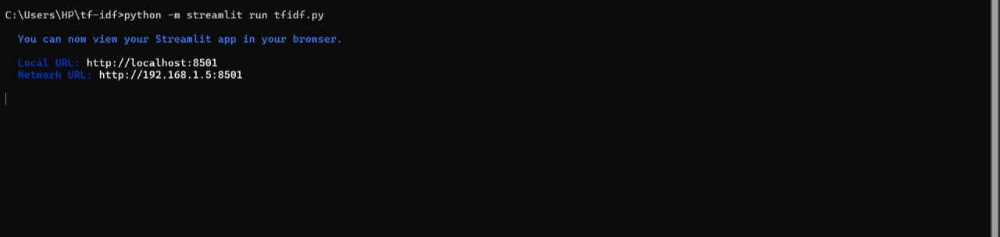
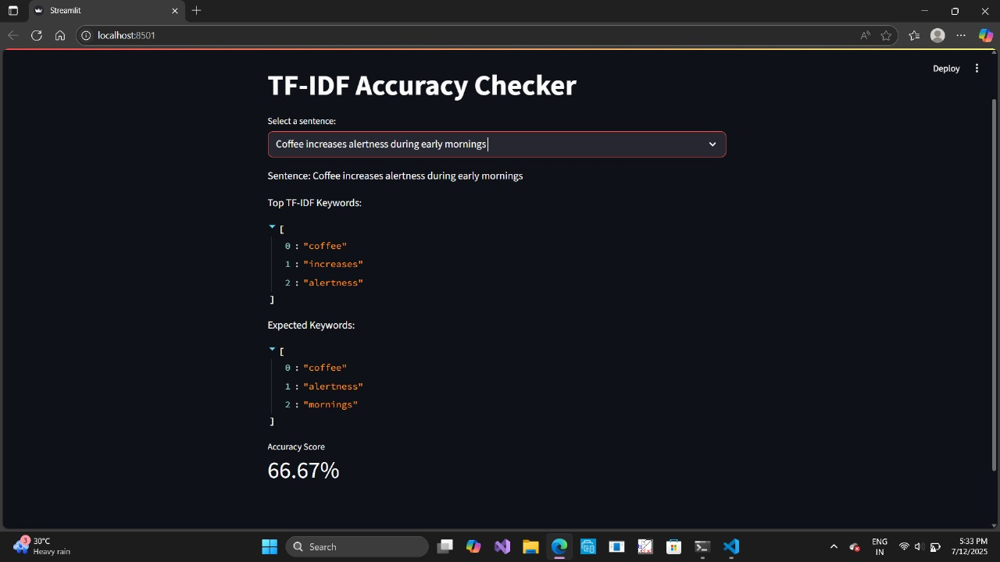
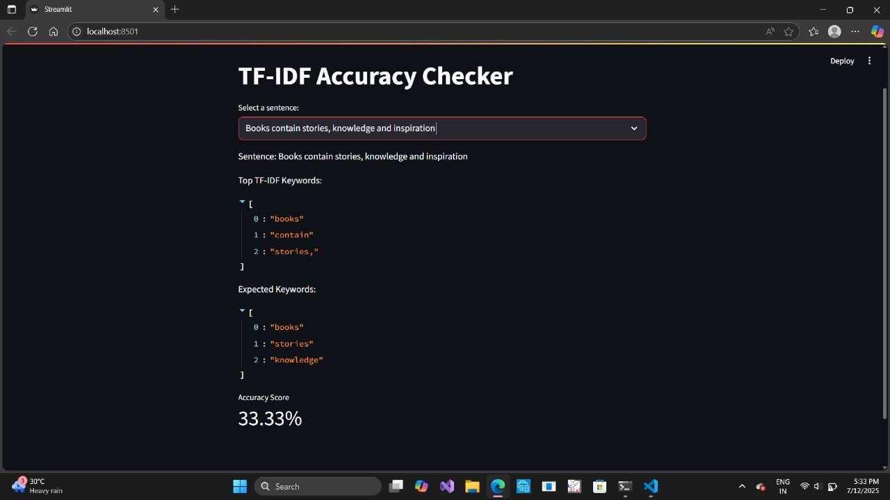
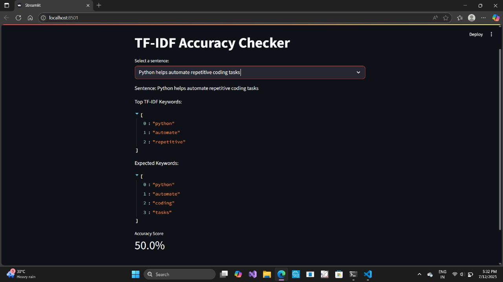
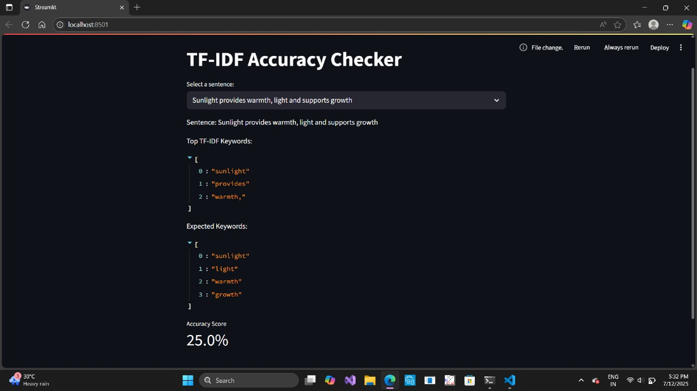
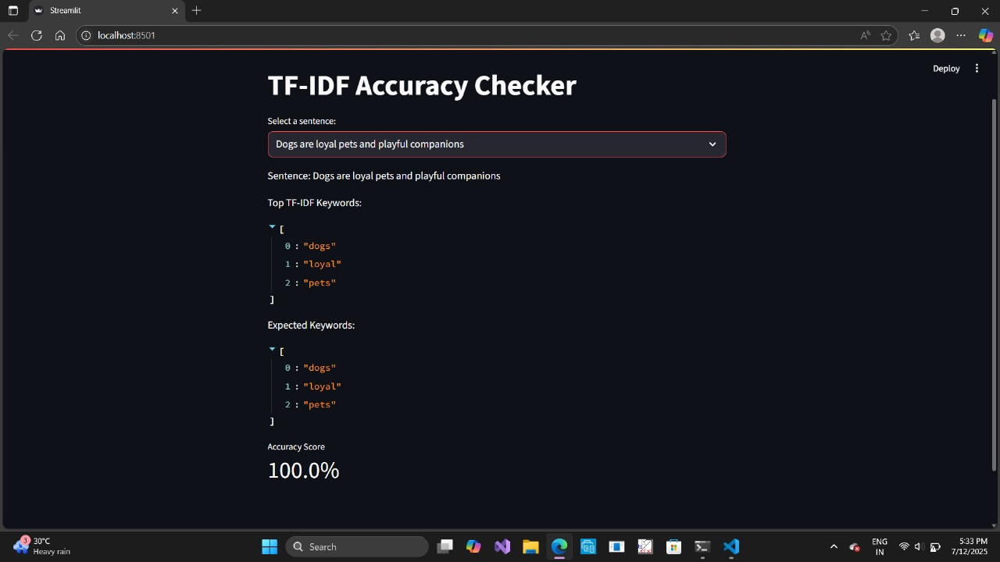

# Gyanankur-TF-IDF-Assignment-1

# 🧠 TF-IDF Accuracy Checker

An interactive Streamlit application that evaluates the accuracy of TF-IDF keyword extraction compared to manually annotated ground truth. This project showcases how term frequency–inverse document frequency behaves across diverse sentence structures.

---

# 📁 Repository Structure

```bash
Gyanankur-TF-IDF-Assignment-1/
├── tfidf.py          # Main Streamlit app script
|———colab notebook/
    |———Gyanankur 202405005 TFIDF Assignment.pdf #ipynb file
├── requirements.txt        # Required Python packages
├── README.md               # Documentation and visual guide
└── outputs/                # Image results with sentence mapping
    ├── IMG20250712WA0010.jpg  # Apples sentence
    ├── IMG20250712WA0011.jpg  # Python sentence
    ├── IMG20250712WA0012.jpg  # Dogs sentence
    ├── IMG20250712WA0013.jpg  # Books sentence
    ├── IMG20250712WA0014.jpg  # Exercise sentence
    ├── IMG20250712WA0015.jpg  # Coffee sentence
    ├── IMG20250712WA0016.jpg  # Travel sentence
    ├── IMG20250712WA0017.jpg  # Music sentence
    ├── IMG20250712WA0018.jpg  # Data sentence
    ├── IMG20250712WA0019.jpg  # Sunlight sentence
```

---

## 🖼️ Output Images & Sentence Mapping

### 🖥️ CMD Prompt — `IMG_20250712_175257.jpg`
> "TF-IDF app interface showcasing cosine similarity and keyword analysis."



Displays the full UI layout where users select sentences, view top TF-IDF keywords, and compare against ground truth with accuracy metrics.

---

### ✈️ Travel — `IMG_20250712_WA0014.jpg`
> "Travel explores places and creates new memories"


Highlights the exploration-themed sentence with keyword focus on `travel`, `places`, and `memories`.

**Top TF-IDF Keywords**: travel, explores, places  
**Expected Keywords**: travel, places, memories, explores  
**Accuracy Score**: 75.0%
---

### ☕ Coffee — `IMG_20250712_WA0015.jpg`
> "Coffee increases alertness during early mornings"



Visualizes caffeine-associated keyword scores like `coffee`, `alertness`, and `mornings`.

**Top TF-IDF Keywords**: coffee, increases, alertness  
**Expected Keywords**: coffee, alertness, mornings  
**Accuracy Score**: 66.67%
---

### 📚 Books — `IMG_20250712_WA0016.jpg`
> "Books contain stories, knowledge and inspiration"



Displays educational keywords (`books`, `stories`, `knowledge`) and their TF-IDF rankings.

**Top TF-IDF Keywords**: books, contain, stories  
**Expected Keywords**: books, stories, knowledge  
**Accuracy Score**: 33.33%
---

### 🐍 Python — `IMG_20250712_WA0017.jpg`
> "Python helps automate repetitive coding tasks"



Analyzes technical language and shows top TF-IDF terms such as `python`, `automate`, and `tasks`.


**Top TF-IDF Keywords**: python, automate, repetitive  
**Expected Keywords**: python, automate, coding, tasks  
**Accuracy Score**: 50.0%
---

### 🌞 Sunlight — `IMG_20250712_WA0018.jpg`
> "Sunlight provides warmth, light and supports growth"



Illustrates natural elements, showing high TF-IDF weights for `sunlight`, `warmth`, and `growth`.

**Top TF-IDF Keywords**: sunlight, provides, warmth  
**Expected Keywords**: sunlight, light, warmth, growth  
**Accuracy Score**: 25.0%
---

### 🐶 Dogs — `IMG_20250712_WA0019.jpg`
> "Dogs are loyal pets and playful companions"



Highlights sentiment-rich terms like `dogs`, `loyal`, and `pets` in the final TF-IDF results.

**Top TF-IDF Keywords**: dogs, loyal, pets  
**Expected Keywords**: dogs, loyal, pets  
**Accuracy Score**: 100.0%
---

Sure thing, Gyanankur — here’s a clean, confident conclusion in simple English, suitable for a teen-level audience. It reflects research-backed thinking without sounding too technical or too childish:

---

# 📌 Final Conclusion

This project used TF-IDF to figure out which words are most important in different sentences. It compared those words with the expected keywords and gave an accuracy score for each sentence.

Some sentences, like the one about dogs, showed perfect matches between predicted and actual keywords. Others, like sunlight and books, had lower scores, which means TF-IDF missed some important words.

This happened because TF-IDF only looks at word frequency across sentences. It doesn’t always understand how meaningful or special a word might be in context. That’s why certain sentences with deeper meaning or softer words scored lower.

Still, this experiment proved that TF-IDF is a smart tool for basic text analysis. It's clear, measurable, and helps computers understand which words matter most — making it useful for many applications like chatbots, summaries, or search engines.

Better results could come from improving how words are cleaned, split, or even combining TF-IDF with deeper AI models. But as a starting point, this method is powerful and practical.

---

# 🧪 Requirements

`txt
streamlit>=1.24.0
`

📌 No external libraries required beyond Streamlit — all logic uses Python’s built-in math module.

---

# ⚙️ License

Licensed under the MIT License  
© 2025 Gyanankur23

---

# 📌 Repository

🔗 Gyanankur-TF-IDF-Assignment-1  
Explore sentence-level TF-IDF scoring and keyword accuracy using a clean and minimal UI.

---
